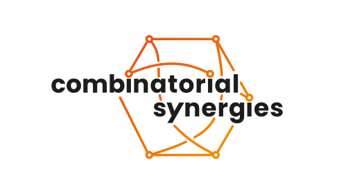

page-title: Polyhedra in Lean
---

This workshop will take place **August 24 -- September 4, 2026** at **FU Berlin**.

We bring together experts on **Lean and formalization**, experts on the various aspects of **polyhedral geometry and combinatorics**, and researchers interested in or curious about these topics. 
Our goal is to plan and accelerate the formalization of the foundations of polyhedral theory in the Lean language and their integration into mathlib, aiming for long term collaboration.

## Invited Experts

* [Xavier Allamigeon](http://www.cmap.polytechnique.fr/~allamigeon/)
* [Jesús De Loera](https://www.math.ucdavis.edu/~deloera/)
* [Yaël Dillies](https://www.su.se/english/profiles/y/yadi8568)
* [Moritz Firsching](https://firsching.ch/)
* [Michael Rothgang](https://www.math.uni-bonn.de/people/rothgang/)
* [Justus Springer](https://www.math.uni-tuebingen.de/de/forschung/algebra/personen/justus-springer)
* [Kim Völlinger](https://www.tu.berlin/en/mtv/team/research-associates/dr-kim-voellinger)
<!--* [Louis Theran](https://theran.lt/)-->

## Organisers
* [Georg Loho](https://lohomath.github.io/)
* [Olivia Röhrig](https://iol.zib.de/team/olivia-roehrig.html)
* [Martin Winter](https://martinwintermath.github.io/)

## Schedule

The main part of the workshop will consist of group work, formalizing selected topics around polytopes/polyhedra in Lean.
On some days we will have a talk on the topics of Lean, formalization, AI and/or polyhedral geometry and combinatorics.

<section class="workshop-schedule" aria-labelledby="schedule-heading">
  <div class="schedule-grid">
    <section class="schedule-card" aria-labelledby="opening-day-title">
      <header><h3 id="opening-day-title">Opening day <span class="date">Monday, 24 August</span></h3></header>
      <ol class="agenda">
        <li><time datetime="2026-08-24T9:00">9:00</time><span>Registration</span></li>
        <li><time datetime="2026-08-24T10:00">10:00</time><span>Welcome, introduction, technical setup, <br>repository overview, and project discussion</span></li>
        <li><time datetime="2026-08-24T12:00">12:00</time><span>Lunch (options <a href="RestaurantsCafes_Dahlem.pdf">here</a>)</span></li>
        <li><time datetime="2026-08-24T14:30">14:30</time><span>Group formation</span></li>
        <li><time datetime="2026-08-24T15:00">15:00</time><span><strong>Justus Springer:</strong> Introduction to Lean</span></li>
        <li><time datetime="2026-08-24T16:00">16:00</time><span><strong>Michael Rothgang:</strong> Introduction to Mathlib</span></li>
      </ol>
    </section>
    <section class="schedule-card" aria-labelledby="routine-title">
      <header><h3 id="routine-title">Typical group-work day</h3></header>
      <table class="schedule-table">
        <caption class="sr-only">Standard daily schedule for group-work days</caption>
        <tbody>
          <tr><td><time datetime="10:00">10:00</time></td><td>Soft start (meet directly in groups)</td></tr>
          <tr><td><time datetime="12:00">12:00</time></td><td>Lunch (options <a href="RestaurantsCafes_Dahlem.pdf">here</a>)</td></tr>
          <tr><td><time datetime="14:00">14:00</time></td><td>Talk, information session, etc</td></tr>
          <tr><td><time datetime="17:00">17:00</time></td><td>All-groups status update</td></tr>
        </tbody>
      </table>
    </section>
  </div>

  <h3>Talks and special sessions</h3>
  <p>Unless listed here, the day follows the group-work schedule above.</p>

  <table class="schedule-table exceptions">
    <caption class="sr-only">Talks and sessions that supplement or replace the typical group-work programme</caption>
    <thead><tr><th scope="col">Date</th><th scope="col">Additional program</th></tr></thead>
    <tbody>
      <tr><td class="date-cell"><time datetime="2026-08-26">Wed, 26 August</time></td><td>
        <ul class="event-list">
          <li>Workshop photo (week 1)</li>
          <li><strong>Xavier Allamigeon:</strong> Polyhedra in Rocq</li>
          <li>Social evening</li>
        </ul>
      </td></tr>
      <tr><td class="date-cell"><time datetime="2026-08-27">Thu, 27 August</time></td><td>
        <ul class="event-list">
          <li><strong>Moritz Firsching:</strong> The Formal Conjectures project</li>
        </ul>
      </td></tr>
      <tr><td class="date-cell"><time datetime="2026-08-28">Fri, 28 August</time></td><td>
        <ul class="event-list">
          <li>Recap of the week</li>
          <li>Recreational activity (start ca 15:00)</li>
        </ul>
      </td></tr>
      <tr><td class="date-cell"><time datetime="2026-08-31">Mon, 31 August</time></td><td>
        <ul class="event-list">
          <li><strong>Kim Völlinger:</strong> Polyhedra at Work: Neural Network Verification in Rocq</li>
        </ul>
      </td></tr>
      <tr><td class="date-cell"><time datetime="2026-09-01">Tue, 1 September</time></td><td>
        <ul class="event-list">
          <li><strong>Yaël Dillies:</strong> Using AI for writing Lean</li>
        </ul>
      </td></tr>
      <tr><td class="date-cell"><time datetime="2026-09-02">Wed, 2 September</time></td><td>
        <ul class="event-list">
          <li>Workshop photo (week 2)</li>
          <li><strong>Jesús de Loera:</strong> AI and the future of Polyhedral Research</li>
          <li>Social evening</li>
        </ul>
      </td></tr>
      <tr><td class="date-cell"><time datetime="2026-09-04">Fri, 4 September</time></td><td>
        <ul class="event-list">
          <li>Recap of the week</li>
          <li>Discussion of the future of the project</li>
          <li>Official end: 15:00</li>
        </ul>
      </td></tr>
    </tbody>
  </table>

</section>

## Venue

Registration: 
 - **Arnimallee 2** (Villa)

All-groups meetings: 
 - **Arnimallee 6** (Pi Building) SR 031

Rooms for group work:
 - **Arnimallee 2** (Villa): seminar room, 002, K007
 - **Arnimallee 3**: 115, 119, 120
 - **Arnimallee 6** (Pi Building): SR 031

For a map of the FU campus Dahlen click [here](Dahlem_Karte_LeanWorkshop.pdf).

## Registration

The registration is now closed.
We extended the format so as to accommodate everyone previously on the waiting list. If you registered on or before July 16, we are pleased to confirm your place in the workshop.

We offer limited travel funds for young researchers. The application is close.
All applicants have been contacted about the status of their application.

<!--The capacity of the workshop has been reached and the official registration is now closed. If you are still interested in participating, and would like to be added to the **waiting list**, please fill in the form [here](https://my.liberaforms.org/pil-fub-2026-registration).

There are limited travel funds available for young researchers.
If you would like to apply for them, please send us a short motivation letter (max 1 page) and the name and email address of one reference we may contact. The deadline is **July 1, 2026**.-->

## What you need to participate

There will be a setup session on the first day, but ideally you already come with the following: 
* your own computer
* a working [Lean installation](https://lean-lang.org/install/)
* [VSCode](https://code.visualstudio.com) (Microsoft), [vscodium](https://vscodium.com) (freely licensed) or some other Lean capable IDE. You already have this if you followed the guide linked in the line above.
* a [git](https://git-scm.com/install/) installation
* an account at the [Lean Zulip instance](https://leanprover.zulipchat.com/)
* a typechecked clone of the [workshop fork GitHub repository](https://github.com/Workshop-Polyhedra-In-Lean/Polyhedral). You can get it by running the following commands in a command line:
  ```
    git clone https://github.com/Workshop-Polyhedra-In-Lean/Polyhedral.git
  ```
  To enter the cloned repository's folder use
  ```
    cd Polyhedral
  ```
  Then download the pre-compiled binaries, otherwise the next command can take hours to execute:
  ```
    lake exe cache get
  ```
  This might need up to 10GB of disk memory and several minuts for downloading depending
  on your internet connection and computer.
  Confirm that it builds using
  ```
    lake build
  ```
  There will be some warnings, most of which come from the remaining `sorry`-s. You can ignore them.

## Lean resources

To get started with writing Lean, we list here some of the most important learning resources:

- [Lean learning games](https://adam.math.hhu.de/)

- Freely available e-books:
  - [Mathematics in Lean](https://avigad.github.io/mathematics_in_lean/)
  - [Formalising Mathematics](https://www.ma.imperial.ac.uk/~buzzard/xena/formalising-mathematics-2022/index.html)
  - [Theorem Proving in Lean 4](https://leanprover.github.io/theorem_proving_in_lean4/)

- [Introduction to Formal Mathematics with Lean 4](https://sun123zxy.github.io/lean4-formal-math-intro/intro.html)

- [Paperproof](https://github.com/Paper-Proof/paperproof), a Lean theorem-proving interface designed to feel like pen-and-paper proofs.

For looking up theorems, try [Loogle](https://loogle.lean-lang.org/), [leansearch](https://leansearch.net) or 
the [mathlib documentation](https://leanprover-community.github.io/mathlib4_docs/index.html).

## Funding

We thankfully acknowledge the supporty by [MATH+](https://mathplus.de/) and the [SPP 2458 "Combinatorial Synergies"](https://www.combinatorial-synergies.de/).

<div id="logos">
  <p>
    
  </p>
  <p>
    
  </p>
</div>
